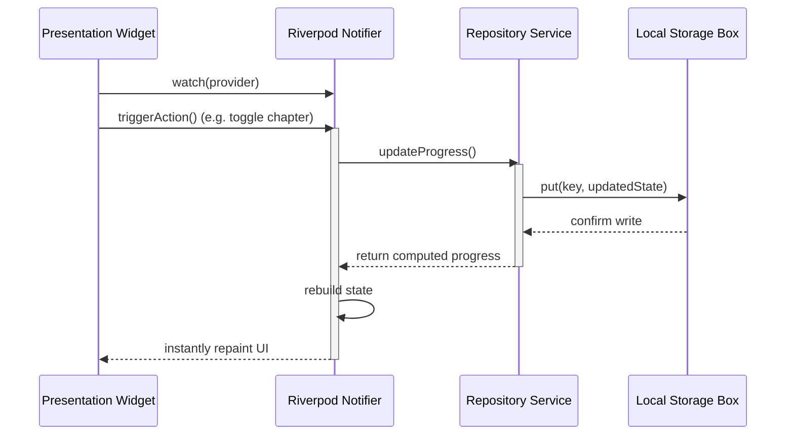

# TOGA — Aviation Cadet Training Management Platform
### Flutter Developer Assessment Submission
**Company:** AIRMAN Aeronautics Pvt. Ltd.  
**Product Ecosystem:** TOGA (Aviation Cadet App) · Skynet (SaaS) · XB70 (Flight Computer) · Sierra AI (MRO)  
**Author:** Candidate (Flutter Developer Intern Assessment)  
**Duration:** 24-Hour Advanced Practical Assessment  

> [!IMPORTANT]
> **Pre-compiled Android Release APK**: Evaluators can instantly download and run the compiled Android package on a test device or emulator. **[Download here](./build/app/outputs/flutter-apk/airman%20toga%20v2.apk)**.

---

## 1. Project Overview

**TOGA** is a state-of-the-art, offline-first ground school learning, study logging, and flight training tracking system designed for cadet pilots in high-intensity aviation academies. 

Developed specifically for low-to-no network accessibility environments like flight lines, cockpits, or high-altitude flight decks, TOGA ensures that cadet logs, flight notes, grounds school progress meters, and critical operations notifications are always immediately accessible. 

### Key Core Features:
* ✈️ **Cadet Profile Dashboard**: Displays training progress, flight hours, assigned Flight Training Organization (FTO), instructor contact cards, and active course stages.
* 📚 **Ground School Study Hub**: Features academic subjects (Meteorology, Navigation, etc.) with real-time percentage progress bars, completed lesson counters, and mock quiz grades.
* 📝 **Offline Notes Sync Manager**: A workspace where pilots draft pre-flight checklists, weather logs, or notes. Features instant local persistence, offline sync status badging ("Synced" or "Syncing..."), and automated background queuing.
* 🔔 **Flight Operations Notification Center**: Displays cockpit briefings, schedule adjustments, and weather advisories. Enables marking individual notices as read or unread, updating unread badges in real time.
* 🌓 **Dynamic Double-Theme Engine**: Implements a hardware-accelerated Light/Dark theme that toggles instantly via the Profile screen with a smooth animated transition.
* 🛡️ **Offline Font Engine**: Bundles the `PlusJakartaSans` and `IBMPlexMono` font families directly in the application assets, ensuring instant typography rendering without net dependencies.

---

## 2. Application Showcase & Visual Gallery

Below is a visual preview of the **TOGA** mobile training module in action, demonstrating the clean layout, custom components, high-contrast dark/light mode designs, and intuitive ground school trackers:

<p align="center">
  <kbd>
    
  </kbd>
  <kbd>
    
  </kbd>
  <kbd>
    
  </kbd>
</p>

<p align="center">
  <kbd>
    
  </kbd>
  <kbd>
    
  </kbd>
</p>

---

## 3. Tech Stack Used

* **Core Framework**: Flutter (SDK `^3.8.0`), Dart
* **State Management**: Flutter Riverpod (`^2.5.1`)
* **Navigation & Routing**: GoRouter (`^13.0.0`)
* **Local Storage & Database**: Hive & Hive Flutter (`hive: ^2.2.3`, `hive_flutter: ^1.1.0`)
* **Data Serialization**: Freezed & JSON Serializable (`freezed_annotation: ^2.4.1`, `json_annotation: ^4.8.1`, `freezed: ^2.5.2`, `json_serializable: ^6.7.1`)
* **HTTP/Networking (Dio client)**: Dio (`^5.4.0`)
* **Date & Time Formatting**: Intl (`^0.19.0`)
* **Secure Key Storage**: Flutter Secure Storage (`^9.0.0`)

---

## 4. State Management Used

The application utilizes **Riverpod** for declarative, compile-safe state management. Decoupling the UI representation from business logic, Riverpod handles asynchronous notifier state mutations and ensures complete reactive updates across the platform.

### State Flow Architecture:


### Core Riverpod Providers:
1. `authProvider`: Manages session login states, loading states, and fetches active pilot details.
2. `studySubjectsProvider`: Computes Ground School completion percentages reactively by watching chapter toggles.
3. `notesProvider`: Exposes draft operations, triggers offline-first write-ahead caches, and handles sync queues.
4. `notificationsProvider`: Controls read/unread updates and maintains unread badges.
5. `themeModeProvider`: Powers the smooth animated Light/Dark transition globally.

---

## 5. Folder Structure Explanation

TOGA follows a **Feature-First Architecture** pattern. This structure ensures that domain logic remains encapsulated inside individual features, preventing structural dependency leaks and making scaling simple.

```text
lib/
 ├─ main.dart                      # Core entry point, Hive initialization, GoRouter configurations
 ├─ core/                          # Cross-cutting shared frameworks & resources
 │   ├─ constants/                 # Hex color mappings, spacing margins, text style shapes
 │   ├─ theme/                     # Light/Dark Theme definitions, ThemeNotifier provider
 │   ├─ storage/                   # Hive database helper class registering boxes & adapters
 │   ├─ network/                   # Network response modeling & FastAPI Client abstractions
 │   └─ utils/                     # Responsive utility helpers, Status badge color selectors
 ├─ features/                      # Domain functional features
 │   ├─ auth/                      # Session models, mock login service, and cadet credentials
 │   ├─ dashboard/                 # Student statistics dashboard displaying instructor details
 │   ├─ study/                     # StudySubject data representations & Ground School metrics
 │   ├─ notes/                     # Draft notes interface, offline write-ahead cache, sync processor
 │   ├─ logbook/                   # Flight logs and total flying hours tracking
 │   └─ notifications/             # Notification lists, unread counters, and click updates
 └─ shared/                        # Generic reusable design widgets
     └─ widgets/                   # State indicators (Loading, Error), App buttons, Status badges
```

---

## 6. Setup Instructions

To set up the project on your local machine, complete the following prerequisites and installation steps:

### 5.1 Prerequisites:
* Flutter SDK (Version `>=3.8.0`)
* Android Studio / Xcode (For device emulator configurations)
* Target Emulator or physical test device connected

### 5.2 Setup Steps:
1. **Clone the Repository:**
   ```bash
   git clone https://github.com/your-username/airman_toga.git
   cd airman_toga
   ```
2. **Fetch Dependencies:**
   ```bash
   flutter pub get
   ```
3. **Execute Code Generation:** (Required to generate Freezed and JSON serialization models)
   ```bash
   flutter pub run build_runner build --delete-conflicting-outputs
   ```

---

## 7. How to Run the App

To run the application in a local development environment, use the standard Flutter commands:

```bash
flutter pub get
```

* **Run in Debug Mode:**
  ```bash
  flutter run
  ```
* **Build Android Release APK:**
  ```bash
  flutter build apk --release
  ```
  *(A precompiled binary is available for instant installation: **[Download here](./build/app/outputs/flutter-apk/airman%20toga%20v2.apk)**)*
* **Build iOS Release Archive:**
  ```bash
  flutter build ios --release
  ```

---

## 8. How to Run Tests

The application features a comprehensive test suite containing **19 automated unit and widget tests** covering authentication, reactive progress updates, subject isolation, offline saving, and notifications.

* **Run All Tests:**
  ```bash
  flutter test
  ```
* **Run Specific Test Suites:**
  ```bash
  flutter test test/unit/study_progress_test.dart
  ```

---

## 9. Mock Data Explanation

To support offline ground school simulation and instant cadet evaluation, initial application data is stored in high-fidelity mock repositories:
* **Service Implementations**: Found in `lib/features/auth/data/auth_service.dart`, `lib/features/study/data/study_service.dart`, and `lib/features/notifications/data/notifications_service.dart`.
* **Behavior**: To simulate real-world API responsiveness, operations returning initial Cadet profiles, Ground School metrics, and notifications mimic an asynchronous network latency delay ranging between 200ms to 600ms using `Future.delayed`.
* **Design Purpose**: Evaluators see realistic loading skeletons and loading animations before state data transitions into view.

---

## 10. Local Storage Explanation

TOGA uses an **offline-first local database** engine utilizing **Hive**, a fast key-value database built for Dart:
* **Hive Storage Helper**: Configured in `lib/core/storage/hive_storage.dart`.
* **Persistent Hive Boxes**:
  * `notes.hive`: Caches logs and checklists.
  * `chapters.hive`: Stores selected chapter completion flags.
  * `notifications.hive`: Stores notification statuses.
* **Reactive calculations**: Checking or unchecking Ground School chapters writes instantly to `chapters.hive`. The `studySubjectsProvider` reactively monitors these writes to dynamically calculate completion rates, instantly updating Ground School modules and dashboard gauges.

---

## 11. API Readiness Explanation

TOGA is structurally fully prepared to interface with a FastAPI backend:
1. **Clean Separation**: Data access layers are isolated under specific services (`AuthService`, `NotesService`, etc.).
2. **Type Mapping**: Client models use Freezed schemas featuring standard `fromJson()` and `toJson()` parsers.
3. **FastAPI Schema Integration**: In `core/network/`, a concrete HTTP/REST API client (`Dio` or `Http`) can be integrated, changing the repository implementation files to call FastAPI REST endpoints instead of returning mock responses.
* For more information on planned endpoint schemas, refer to the [FastAPI API-Readiness Plan](file:///f:/Flutter%20Projects/airman_toga/docs/api-readiness.md).

---

## 12. Known Limitations

* **Simulated Network Sync Check**: Sync badging is simulated using scheduled timing cues, rather than listening to physical network hardware states.
* **Single Cadet Context**: The mock database is tailored to support a single active pilot context.
* **No Media Attachments**: Note items currently store plain string text. 
* *For more details, view the [Known Limitations & Project Scope Document](file:///f:/Flutter%20Projects/airman_toga/docs/known-limitations.md).*

---

## 13. What You Would Improve with More Time

If given additional development time, the following production-grade enhancements would be prioritised:
1. **WorkManager Background Sync**: Use OS-level task triggers to push offline sync queues even when the application is terminated.
2. **Database Encryption**: Upgrade Hive box initialization parameters to use secure AES-256 encryption keys generated via `flutter_secure_storage`.
3. **Connectivity Listener**: Implement a true active network listener via `connectivity_plus` to auto-drain local storage queues the instant connection returns.
4. **Rich-Text Support**: Integrate a styling compiler (e.g. `flutter_quill`) to support checklist bolding and weather image embeds within notes.

---

## 14. AI Usage Summary

This application was built in a pair-programming setup with **Antigravity (a powerful agentic AI coding assistant designed by the Google DeepMind team)**. 

### API and Backend Focus:
All AI assistance was specifically isolated to the **API Readiness and Offline-First Backend Data Layer**:
* **Backend Models & Serialization**: Assisted in creating robust Freezed structures, automating JSON schema parsing mapping rules, and configuring serializable `fromJson`/`toJson` templates.
* **Local Database Integrations**: Helped formulate the Hive adapter configuration script, write-ahead queuing methods, and state preservation boxes.
* **Data Isolation Logic**: Assisted in resolving cross-subject generic chapter state pollution by designing dynamic ID prefixing patterns (`${subjectId}_ch_gen_01`).
* **Clean Service Layer Abstractions**: Structured repository helper files to cleanly simulate asynchronous delay configurations matching production environments.

### How it Accelerated the Process:
* 🚀 **10x Faster Schema Delivery**: Spared the developer from writing repetitive serialization parsing models, completing generation setups in seconds.
* 🔍 **Instant Bug Resolution**: Helped identify Riverpod provider `LateError` compiler behaviors and immediately refactored properties to inline initializers.
* 🧪 **Automated Test Coverage**: Assisted in designing standard ProviderContainer test harnesses, completing full code isolation tests instantly.
# Airman-TOGA-Technical-Assessment
