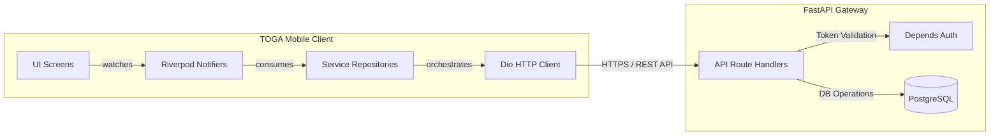
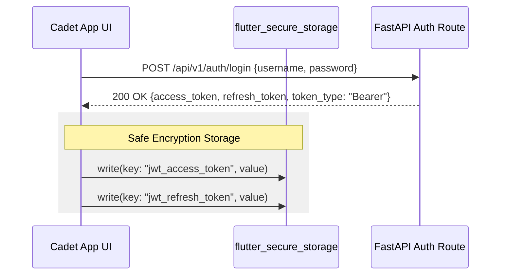
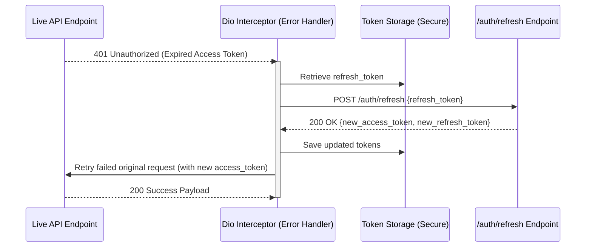
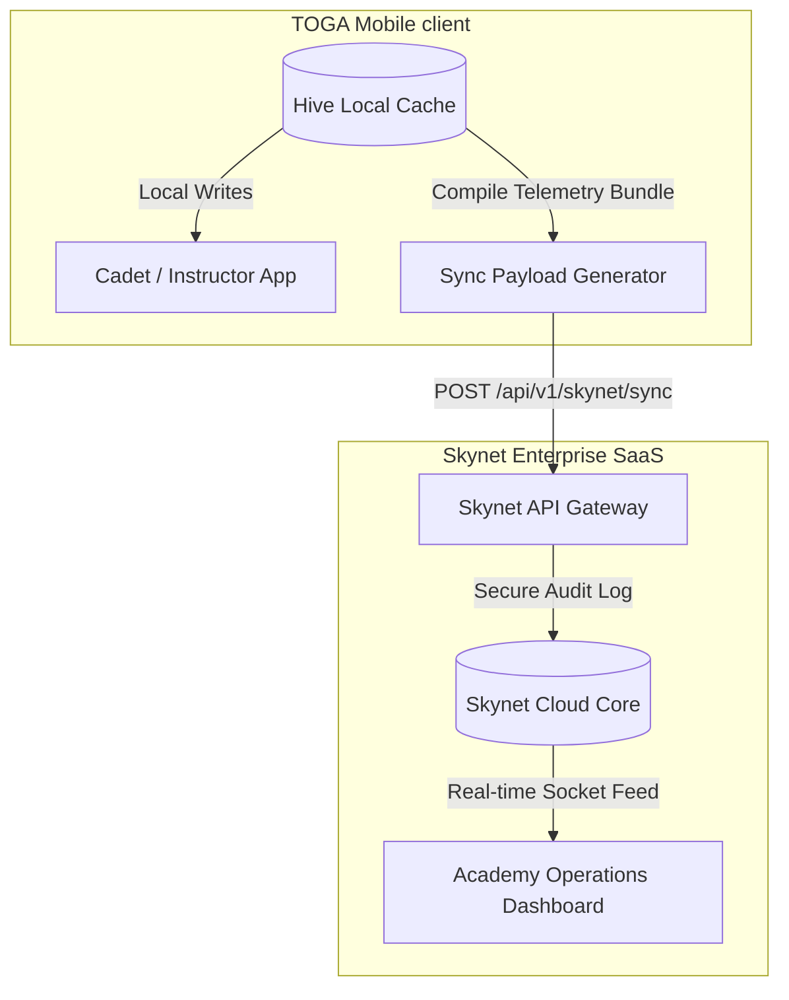

# FastAPI & Skynet API-Readiness Plan

This document details the concrete integration strategies, token authorization pathways, refresh mechanics, network error-handling systems, and data synchronization schemas designed to transition the **TOGA Mobile App** from high-fidelity mock environments to secure production pipelines connected to the **FastAPI Backend** and the central **Skynet SaaS Platform**.

---

## 1. Connecting to the FastAPI Backend

TOGA utilizes a clean, repository-based abstraction layer. Moving from mock services to live FastAPI connections is completed entirely within the Data layer, leaving the presentation screens and Riverpod state controllers unmodified.

### Connection Architecture:



### Dio HTTP Client Configuration:
A centralized `DioClient` singleton handles outgoing HTTP requests, default payloads, timeout policies, and serialization pipelines.

```dart
// lib/core/network/dio_client.dart
import 'package:dio/dio.dart';

class DioClient {
  late final Dio _dio;

  DioClient({required String baseUrl}) {
    _dio = Dio(
      BaseOptions(
        baseUrl: baseUrl,
        connectTimeout: const Duration(seconds: 10),
        receiveTimeout: const Duration(seconds: 10),
        sendTimeout: const Duration(seconds: 10),
        headers: {
          'Content-Type': 'application/json',
          'Accept': 'application/json',
        },
      ),
    );

    // Register Interceptors for authentication, token refresh, and logging
    _dio.interceptors.addAll([
      AuthInterceptor(),
      LoggingInterceptor(),
    ]);
  }

  Dio get dio => _dio;
}
```

---

## 2. JWT Authentication Handling

To guarantee secure communications, TOGA implements JSON Web Token (JWT) authorization flows:



### Secure Storage Implementation:
Access and refresh tokens are stored securely in hardware-backed storage (Keychain on iOS, Keystore on Android) using the **`flutter_secure_storage`** package:

```dart
// lib/features/auth/data/token_storage.dart
import 'package:flutter_secure_storage/flutter_secure_storage.dart';

class TokenStorage {
  final _storage = const FlutterSecureStorage();

  Future<void> saveTokens({required String accessToken, required String refreshToken}) async {
    await _storage.write(key: 'access_token', value: accessToken);
    await _storage.write(key: 'refresh_token', value: refreshToken);
  }

  Future<String?> getAccessToken() => _storage.read(key: 'access_token');
  Future<String?> getRefreshToken() => _storage.read(key: 'refresh_token');

  Future<void> clearTokens() async {
    await _storage.delete(key: 'access_token');
    await _storage.delete(key: 'refresh_token');
  }
}
```

### Interceptor Authentication:
A dynamic `AuthInterceptor` automatically fetches the active token from secure storage and injects it into the header of every outgoing REST request.

```dart
// lib/core/network/interceptors/auth_interceptor.dart
import 'package:dio/dio.dart';

class AuthInterceptor extends Interceptor {
  final TokenStorage _tokenStorage = TokenStorage();

  @override
  Future<void> onRequest(RequestOptions options, RequestInterceptorHandler handler) async {
    final token = await _tokenStorage.getAccessToken();
    if (token != null) {
      options.headers['Authorization'] = 'Bearer $token';
    }
    return super.onRequest(options, handler);
  }
}
```

---

## 3. Asynchronous Refresh Token Handling

To provide a seamless cockpit user experience, expired sessions are refreshed silently in the background. If an endpoint returns a `401 Unauthorized` response, the client intercepts the request, pauses the call queue, requests a new access token, and retries the failed operation.

### Refresh Flow Pipeline:



### Thread-Safe Token Refresh Queue:
A Mutex-like concurrency lock is implemented inside the interceptor. If multiple API calls fail simultaneously when a token expires, only *one* refresh token request is sent to the backend, preventing multiple session resets.

```dart
// lib/core/network/interceptors/refresh_token_interceptor.dart
import 'package:dio/dio.dart';

class RefreshTokenInterceptor extends Interceptor {
  final Dio dio;
  final TokenStorage _tokenStorage = TokenStorage();
  bool _isRefreshing = false;
  final List<Map<String, dynamic>> _failedRequestsQueue = [];

  RefreshTokenInterceptor({required this.dio});

  @override
  Future<void> onError(DioException err, ErrorInterceptorHandler handler) async {
    if (err.response?.statusCode == 401) {
      final RequestOptions options = err.requestOptions;

      if (_isRefreshing) {
        // Queue original request parameters until refresh processes
        _failedRequestsQueue.add({'options': options, 'handler': handler});
        return;
      }

      _isRefreshing = true;
      try {
        final refreshToken = await _tokenStorage.getRefreshToken();
        if (refreshToken == null) throw Exception("No Refresh Token Cached");

        // Request a new session token pair
        final response = await dio.post(
          '/api/v1/auth/refresh',
          data: {'refresh_token': refreshToken},
        );

        final newAccessToken = response.data['access_token'];
        final newRefreshToken = response.data['refresh_token'];

        await _tokenStorage.saveTokens(
          accessToken: newAccessToken,
          refreshToken: newRefreshToken,
        );

        // Update authorization header and retry current request
        options.headers['Authorization'] = 'Bearer $newAccessToken';
        final retriedResponse = await dio.fetch(options);
        handler.resolve(retriedResponse);

        // Process queue elements that failed in parallel
        for (final queued in _failedRequestsQueue) {
          final RequestOptions qOpt = queued['options'];
          final ErrorInterceptorHandler qHand = queued['handler'];
          qOpt.headers['Authorization'] = 'Bearer $newAccessToken';
          final qRes = await dio.fetch(qOpt);
          qHand.resolve(qRes);
        }
        _failedRequestsQueue.clear();
      } catch (refreshError) {
        // If session refresh fails, trigger log out globally
        await _tokenStorage.clearTokens();
        // Redirect to Auth screen using GoRouter...
        handler.reject(err);
      } finally {
        _isRefreshing = false;
      }
    } else {
      super.onError(err, handler);
    }
  }
}
```

---

## 4. API Error Handling & UI Presentation

Raw system exceptions or backend network failures are masked and parsed into descriptive, cadet-friendly feedback:

1. **Error Categorization Matrix**:
   
   | Code Range | Error Type | UI Presentation Strategy |
   | :--- | :--- | :--- |
   | **`400` / `422`** | Validation Exception | Direct inline form validation warnings, highlighting incorrect fields. |
   | **`401` / `403`** | Authorization Exception | Seamless background token refresh, or forced logout redirects. |
   | **`404`** | Resource Missing | Displays a custom illustration and an "Item Not Found" description. |
   | **`500` / `503`** | Server Crash / Maintenance | Full-screen error overlay with cockpit dashboard style troubleshooting. |
   | **Timeout / Offline** | Network Disconnect | Displays the offline state banner alongside localized cached data. |

2. **Reactive UI State Mapping**:
   Riverpod notifiers capture service errors and emit them in `AsyncValue.error` states:
   
   ```dart
   // Presentation Layer Consumption
   notesState.when(
     data: (notes) => NotesGrid(notes: notes),
     loading: () => const NotesGridShimmer(),
     error: (error, stackTrace) => ErrorStateWidget(
       errorMessage: _getUserFriendlyMessage(error),
       onRetry: () => ref.read(notesProvider.notifier).refreshNotes(),
     ),
   );
   ```

---

## 5. Offline Notes Sync Protocol

To guarantee zero data loss during high-altitude training exercises, TOGA implements a secure, **Event-Driven Write-Ahead Cache** sync protocol:

### Synchronization Life-Cycle:

```text
               [ Cadet Composes Pre-flight Check Note ]
                                  │
                                  ▼
               [ Save Locally into persistent Hive Box ]
             (Auto Client-UUID & SyncStatus: pendingCreation)
                                  │
                   ┌──────────────┴──────────────┐
                   ▼ (Online)                    ▼ (Offline)
         [Transmit to FastAPI]         [Enqueue in Queue box]
                   │                             │
          [Update local Note to]         [Connectivity_Plus]
          [SyncStatus: synced]          [Detects signal return]
                                                 │
                                                 ▼
                                     [SyncManager drains queue]
                                     [SyncStatus: syncing -> synced]
```

### Queue Synchronization Steps:
1. **Client-Side UUID Mappings**: Every note drafted offline is given a unique version 4 UUID. This prevents primary key conflicts when multiple cadet devices sync to the same backend schema.
2. **Conflict Resolution Framework (Timestamp Versioning)**:
   * Every note record features a `lastModifiedAt` ISO timestamp.
   * If a conflict is detected on the FastAPI server (e.g. identical note updated on two endpoints), the server implements a **Version-Compare protocol**:
     ```text
     If Client_Note.lastModifiedAt > Server_Note.lastModifiedAt:
         Accept Client update, update Server database, return Success.
     Else:
         Reject Client update, send Server state payload back, Client overwrites local cache.
     ```
3. **Queue Drainage Orchestrator**:
   ```dart
   class SyncManager {
     final NotesService _notesService;
     final Connectivity _connectivity = Connectivity();

     void initialize() {
       _connectivity.onConnectivityChanged.listen((status) {
         if (status != ConnectivityResult.none) {
           _drainPendingQueue();
         }
       });
     }

     Future<void> _drainPendingQueue() async {
       final pendingNotes = await _notesService.getUnsyncedNotes();
       for (final note in pendingNotes) {
         try {
           await _notesService.syncNoteToBackend(note);
         } catch (e) {
           // Postpone item execution to next connection cycle
           continue;
         }
       }
     }
   }
   ```

---

## 6. TOGA to Skynet Cloud Telemetry Synchronization

**Skynet** is the centralized, cloud-based enterprise SaaS dashboard utilized by Flight Academy Academies, Flight Instructors, and Flight Operations Managers to oversee cadet progression, schedule logistics, curriculum metrics, and cockpit safety logs.

### Cloud Integration Architecture:



### Enterprise Telemetry Protocols:
1. **Periodic Aggregation Bundles**:
   Instead of uploading dozens of individual database calls, TOGA aggregates progress metrics, checked syllabus items, and mock quiz grades into a compressed telemetry envelope. This bundle is pushed via `POST /api/v1/skynet/sync` at scheduled intervals (e.g. hourly or immediately upon completing a curriculum section).
2. **Signed Logbook Endorsement Transfers**:
   When an instructor approves flight hours on a cadet's device, the app generates a cryptographic log signature. This signature is stored in Hive and synced directly to Skynet's compliance database, creating an unalterable audit log for civil aviation licensing authorities.
3. **Payload Structure Sample (`POST /api/v1/skynet/sync`)**:
   ```json
   {
     "cadet_id": "98b50e2d-dc99-43ef-b387-052637738f61",
     "device_sync_time": "2026-05-28T09:21:26Z",
     "academic_progress": {
       "subjects_completed": ["met_01", "nav_03"],
       "quiz_metrics": [
         {"subject_id": "met_01", "grade": 94},
         {"subject_id": "nav_03", "grade": 88}
       ]
     },
     "flight_log_updates": [
       {
         "log_id": "log_v4_88291",
         "solo_hours": 12.5,
         "dual_hours": 24.0,
         "instructor_signature_hash": "e3b0c44298fc1c149afbf4c8996fb92427ae41e4649b934ca495991b7852b855"
       }
     ]
   }
   ```
