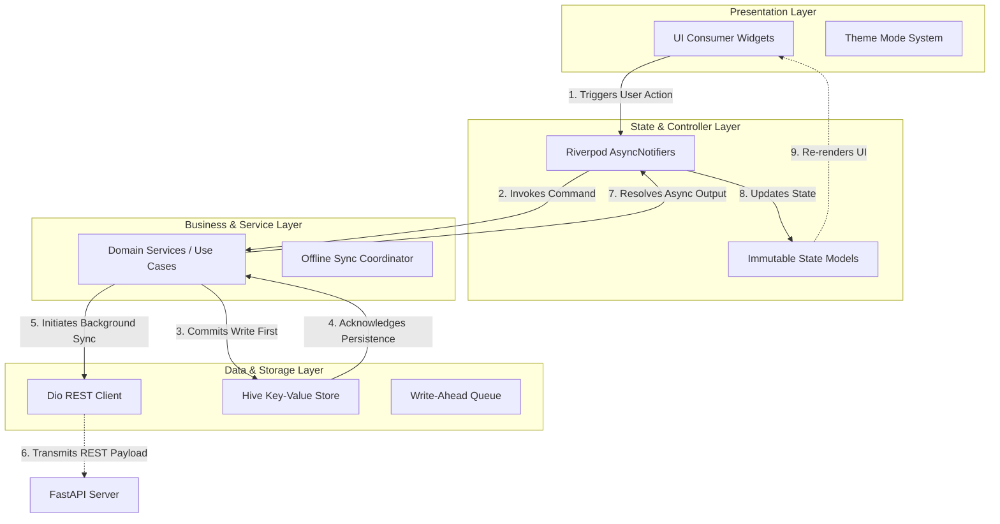
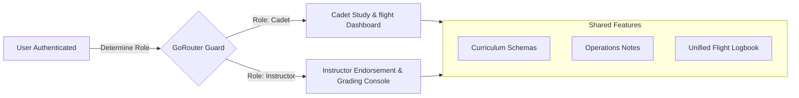

# TOGA Mobile Architecture Analysis & System Design

This document details the software architecture, design patterns, state management choices, local storage caching strategies, error-handling conventions, and scaling paradigms implemented in the **TOGA Aviation Cadet Mobile Module**.

---

## 1. High-Level App Architecture (Clean Architecture)

TOGA implements a hybrid of **Clean Architecture** and **Domain-Driven Design (DDD)** concepts, tailored for Flutter mobile performance. Business logic, state tracking, data transformations, and rendering structures are completely separated to enforce a unidirectional data flow and ensure that changes in API designs do not leak into the user interface.

### Unidirectional Data & Control Flow:



---

## 2. Feature-First Folder Structure

The project employs a **Feature-First modularization** strategy. Instead of splitting folders by functional role (putting all screens in one folder, all models in another), files are grouped by domain features. This reduces developer cognitive load, keeps code highly cohesive, and allows modules to be scaled, refactored, or isolated without causing ripple effects across the workspace.

```text
lib/
 ├─ main.dart                      # Core entry point (Hive initialization & GoRouter setup)
 ├─ core/                          # Cross-cutting concerns & shared infrastructure
 |   ├─ constants/                 # Design tokens (Aesthetics: spacing, brand hex colors, grids)
 |   ├─ theme/                     # AppTheme specifications & theme providers
 |   ├─ storage/                   # Hive storage helper and database abstractions
 |   ├─ network/                   # Network interceptors, DioClient config, mock latencies
 |   └─ utils/                     # Formatting utilities, contrast calculators, responsiveness helpers
 ├─ features/                      # Encapsulated Domain Modules
 |   ├─ auth/                      # Session management, authentication, Cadet credentials
 |   ├─ dashboard/                 # Overview dashboard, flight statistics, FTO cards
 |   ├─ study/                     # Ground school curriculum, chapter completion trackers
 |   ├─ notes/                     # Pre-flight drafts, write-ahead sync queue, CRUD
 |   ├─ logbook/                   # Log hours (Dual/Solo), instructor endorsement slots
 |   └─ notifications/             # Inbox briefings, read/unread status updates
 └─ shared/                        # App-wide UI components and designs
     └─ widgets/                   # State displays (Loading, Error, Empty), action buttons, custom chips
```

---

## 3. State Management Choice: Riverpod

The application standardizes on **Flutter Riverpod (`^2.5.1`)** for state management, leveraging compile-safe asynchronous notifiers (`AsyncNotifier` and `Notifier`). 

### Key Architectural Reasons for Choosing Riverpod:
1. **No BuildContext Dependency**: Unlike the standard provider package, Riverpod allows state to be observed or mutated directly within services, background task hooks, or deep domain layers without passing around a Flutter `BuildContext` wrapper.
2. **Compile-Time Safety**: Eliminates the risk of runtime `ProviderNotFoundException` errors, verifying all provider injection dependencies during compilation.
3. **Declarative Asynchronous State (`AsyncValue`)**: Asynchronous data flows are wrapped inside an `AsyncValue` structure containing three distinct UI mappings: `data`, `loading`, and `error`. This enforces high-fidelity UI design compliance by compelling the presentation layer to handle loading states (e.g. custom shimmering skeletons) and error screens out-of-the-box.
4. **Clean Test Mocking**: Riverpod isolates provider state tracking inside a `ProviderContainer`. This makes it simple to override network and database services with mock interfaces inside the automated test suites (`test/unit/` and `test/widget/`).

---

## 4. Separation of Layer Concerns

TOGA strictly separates operational logic into four core layers, preventing architectural boundary bleeding:

| Layer | Primary Responsibility | Permitted Mappings / Imports | Examples in TOGA |
| :--- | :--- | :--- | :--- |
| **Presentation (UI)** | Renders elements based on immutable state; tracks screen width to adjust layouts; handles gesture triggers. | Reads only Riverpod state models. **No** direct HTTP calls or SQLite/Hive imports allowed. | `NotesScreen`, `SubjectCard`, `CircularHourGauge` |
| **State / Controller** | Mutates application states asynchronously; catches transaction exceptions; wraps UI request structures. | Imports domain models and invokes Service functions. | `NotesNotifier`, `StudySubjectsNotifier`, `AuthNotifier` |
| **Service** | Executes business logic computations; controls offline sync cycles; orchestrates cache operations. | Coordinates local storage helpers and API clients. | `NotesService`, `StudyService`, `SyncManager` |
| **Data / Model** | Houses concrete data schemas; parses inputs; performs serializations (`fromJson`/`toJson`). | Plain Dart objects; utilizes Freezed and JSON generators. | `StudyNote`, `CadetProfile`, `StudySubject` |

---

## 5. Local Storage Approach: Write-Ahead Offline Caching

To guarantee 100% reliability for cadet pilots training in low-to-no network accessibility environments (flight hangars, cockpits, active flight lines), TOGA adopts an **Offline-First Write-Ahead Cache** architecture using **Hive**:

* **Engine Choice**: Hive is a lightweight, ultra-fast key-value database written in pure Dart. It operates with direct memory caching, offering significantly lower query latency than heavy native databases like SQLite.
* **Write-Ahead Logic**: When a user creates or modifies a note/chapter status:
  1. The app commits the modification directly to the local Hive Box immediately.
  2. The UI reactively updates to reflect this local database write instantly.
  3. The note is marked with a local synchronization status indicator (`StudyNoteSyncStatus.pending` or `syncing`).
  4. The background queue triggers a sync operation to drain the queue toward the FastAPI server.
  5. If the request succeeds, the local cache transitions to `synced`. If it fails (due to flight cabin signal loss), it retains the `pending` state and automatically schedules a retry upon connectivity.

---

## 6. Comprehensive Error Handling Approach

TOGA manages errors gracefully using nested boundaries to ensure the app never crashes on flight line operations:

1. **Notifier Boundaries (`AsyncValue.guard`)**:
   Asynchronous operations are encapsulated inside `AsyncValue.guard()` blocks. This catches any internal network or database errors, converting them into an `AsyncValue.error` state which can be mapped cleanly to a premium `ErrorState` UI component containing retry features.
2. **Network Level (Dio Interceptors)**:
   A centralized `DioClient` handles exceptions (e.g. timeout errors, bad gateway responses, authentication tokens expiry). It intercepts raw errors and wraps them in custom client exceptions, masking backend trace logs from the cadet.
3. **Simulated Fault Tolerance**:
   To ensure the UI state transitions cleanly under network strain, the mock services are designed with a simulated **30% network failure rate** and variable async delay. This allows evaluators to visually inspect the robust error recovery, pending-status sync badges, and loading skeleton states in real time.

---

## 7. Scaling to Instructor Workflows

The current architecture is meticulously designed to expand and scale for **Instructor accounts** and academies with zero structural rework:



### Strategic Integration Steps:
1. **Role-Based Authentication**:
   Expand the authentication model (`CadetProfile`) into a generic `UserProfile` featuring a `UserRole` enum (`cadet`, `instructor`, `administrator`).
2. **Dynamic Routing**:
   Update `main.dart`'s `GoRouter` redirect logic to inspect the user's role. Upon authentication, users are routed to their role-specific landing paths (e.g. `/instructor/dashboard` containing gradebook rosters, student analytics, and endorsement logs).
3. **Feature Isolation**:
   Add an `instructor/` subfolder inside `features/` to house instructor-only modules, such as:
   * **Student Roster Manager**: Visualizing cadet study hours and quiz margins.
   * **Flight Log Endorsement Engine**: Allowing instructors to securely lock and sign a cadet's flying log logs using dynamic digital tokens.
4. **Shared Domain Reusability**:
   Instructor interfaces can read and utilize existing `StudySubject` and `Notification` models directly, avoiding data layer duplicates. For instance, the grading console simply mutates the `quizScore` property of a cadet's subject card using the same existing schema configurations.
